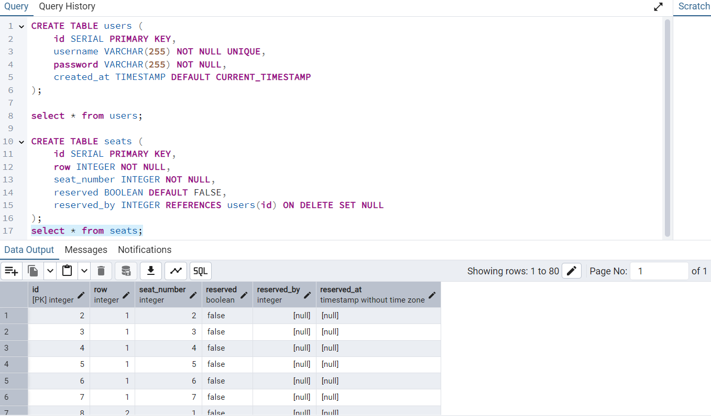

# Train Seat Booking Backend

This is the backend of the Train Seat Booking system, built with Node.js and Express.js. It manages seat availability, reservations, and refresh functionality using PostgreSQL as the database.

---

## Features

- **Fetch Seat Availability**: Provides the current status of all seats.
- **Seat Reservation**: Allows booking up to 7 seats at a time.
- **Refresh Functionality**: Resets all seat reservations to available.

---

## API Endpoints

1. **GET `/api/seats/availability`**  
   - **Description**: Fetches the current status of all seats.
   - **Response**: Returns an array of seat objects with their IDs and reservation status.

2. **POST `/api/seats/reserve`**  
   - **Description**: Reserves the specified number of seats (max 7).  
   - **Request Body**:  
     ```json
     {
       "count": <number>
     }
     ```
   - **Response**: Returns the reserved seats if successful.

3. **POST `/api/seats/refresh`**  
   - **Description**: Resets all seats to "available".
   - **Response**: Confirms successful refresh.

---


## Database Schema



 - **Table Name**: seats
 - **id (integer)**: Primary key for each seat.
 - **reserved (boolean)**: Status of the seat (true = booked, false = available).
 - **reserved_by (integer, nullable)**: User ID of the reserver (nullable for available seats).